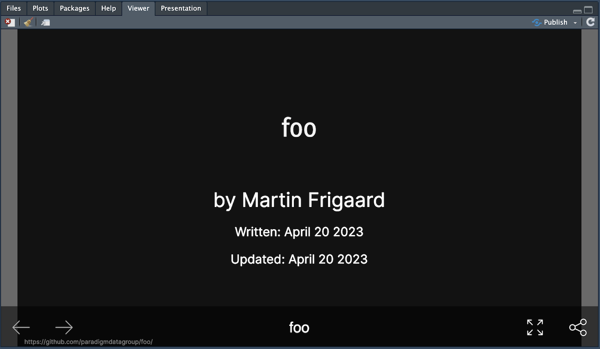
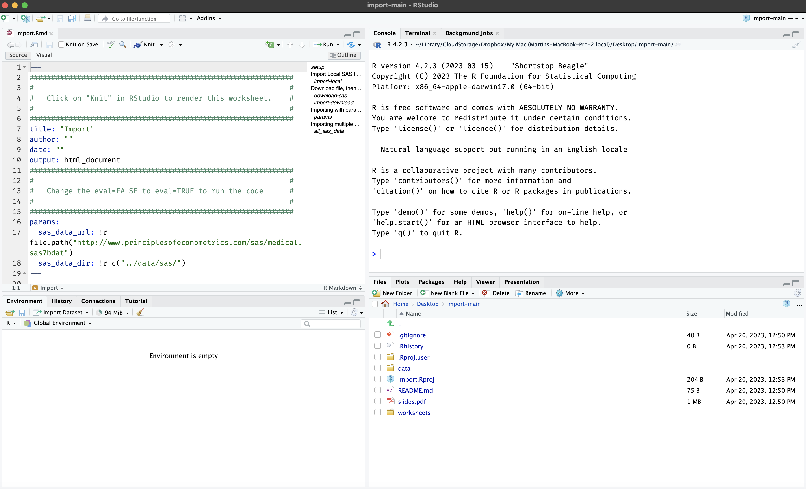

<!-- README.md is generated from README.Rmd. Please edit that file -->

```{r, include = FALSE}
knitr::opts_chunk$set(
  collapse = TRUE,
  comment = "#>",
  fig.path = "man/figures/README-",
  out.width = "100%"
)
library(pdgdev)
remove_dev_dir("foo")
remove_prod_dir("test")
```

# pdgdev

<!-- badges: start -->
<!-- badges: end -->

The goal of `pdgdev` is to provide a set of tools for developing materials for PDG slides and materials. 

## Installation

Install the package below from GitHub: 

```{r , eval=FALSE}
install.packages("remotes")
remotes::install_github("paradigmdatagroup/pdgdev")
```


## Building development materials

Assume I'd like to create a new lesson, `foo`

```{r example}
library(pdgdev)
build_dev("foo")
```

This creates a new folder in `inst/dev/` with the bare minimum files to start developing. 

If I knit `slides.Rmd`, I see the following: 

```{r new_dev_slide, echo=FALSE, fig.align='center', out.width='100%'}

```

<br> 

These are all named accordingly and have uniform styling: 

## Remove development folders

If I want to remove the `foo` folder from development, I can use `remove_dev_dir()`

```{r}
remove_dev_dir("foo")
```

We can see this folder is no longer listed in `inst/dev`:

```{r}
fs::dir_tree("inst/dev/", recurse = FALSE)
```

## Move development materials to production folder

After developing the materials in `inst/dev/`, we want to copy the outputs to `inst/prod/`. There is an example development folder in `inst/dev/`:

```{r test-dev-folder, echo=FALSE}
fs::dir_tree("inst/dev/test")
```

We can see test mimics a full developed lesson with `data/`, `libs/`, `css` (styling) , and `worksheets/`. All the code is in `slides.Rmd`, but we don't want to share that with everyone:

To move only the course materials from `inst/dev/test/` into the production folder (`inst/dev/test/`), use `build_prod()`:

```{r}
build_prod("test")
```

Now the production folder only contains: 

1. An `.Rproj` file  
2. The pdf version of the slides (`slides.pdf`)  
3. the `data/` folder (for reproducibility)  
4. And any worksheets that accompany the lesson  

## Use with `pdg::use_lesson()`

The production folder can be placed in it's own repo on [Paradigm Data Group's GitHub organization](https://github.com/paradigmdatagroup) and used with `pdg::use_lesson()`:

```{r, eval=FALSE}
library(pdg)
pdg::use_lesson("import")
```

```
Downloading into '/Users/mjfrigaard/Desktop/'.
Prefer a different location? Cancel, try again, and specify `destdir`
OK to proceed?

1: Not now
2: Absolutely
3: No
```

Make your selection (or try again with a `destdir` folder)

```
Selection: 2
✔ Downloading from 'https://github.com/paradigmdatagroup/import/archive/refs/heads/main.zip'
Downloaded: 0.89 MB  
✔ Download stored in '/Users/mjfrigaard/Desktop/import-main.zip'
✔ Unpacking ZIP file into 'import-main/' (18 files extracted)
Shall we delete the ZIP file ('import-main.zip')?

1: No
2: Yes
3: Negative
```

Keep or delete the zip file? 

```
Selection: 2
✔ Deleting 'import-main.zip'
✔ Opening project in RStudio
```

## Lesson materials 

```{r use_lesson_new, echo=FALSE, fig.align='center', out.width='100%'}

```

If I need to remove `test` folder from production, I can use:

```{r}
remove_prod_dir("test")
```

```{r}
fs::dir_tree("inst/prod/", recurse = FALSE)
```


