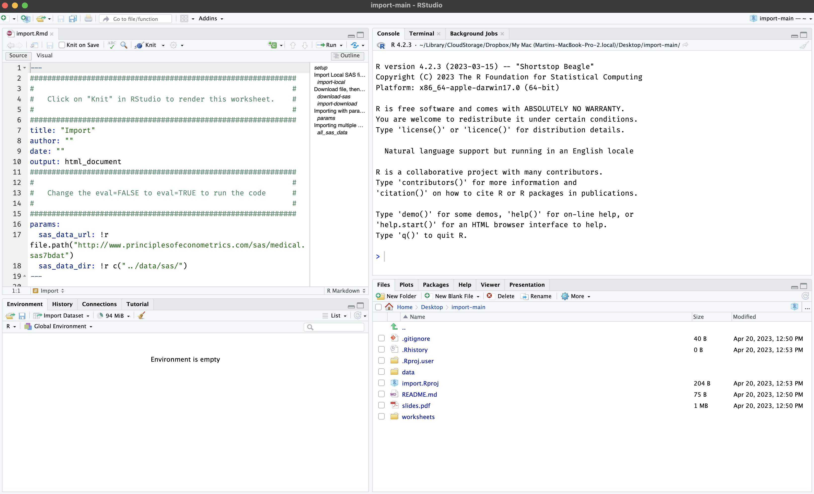

<!-- README.md is generated from README.Rmd. Please edit that file -->

# pdgdev

<!-- badges: start -->
<!-- badges: end -->

The goal of `pdgdev` is to provide a set of tools for developing
materials for PDG slides and materials.

## Installation

Install the package below from GitHub:

``` r
install.packages("remotes")
remotes::install_github("paradigmdatagroup/pdgdev")
```

## Building development materials

Assume I’d like to create a new lesson, `foo`

``` r
library(pdgdev)
build_dev("foo")
#> → 'foo' folder created in inst/dev/!
#> → slides.Rmd file created in inst/dev/foo!
#> → created css folder inst/dev/foo!
#> → created data folder inst/dev/foo!
#> → created styles.css file inst/dev/foo!
#> /Users/mjfrigaard/projects/pkgs/pdgdev/inst/dev/foo
#> ├── css
#> │   └── styles.css
#> ├── data
#> └── slides.Rmd
```

This creates a new folder in `inst/dev/` with the bare minimum files to
start developing.

If I knit `slides.Rmd`, I see the following:


<br>

These are all named accordingly and have uniform styling:

## Remove development folders

If I want to remove the `foo` folder from development, I can use
`remove_dev_dir()`

``` r
remove_dev_dir("foo")
#> → inst/dev/foo/ folder has been removed
```

We can see this folder is no longer listed in `inst/dev`:

``` r
fs::dir_tree("inst/dev/", recurse = FALSE)
#> inst/dev/
#> ├── import
#> ├── iteration
#> ├── objects
#> ├── reshape
#> ├── rmarkdown
#> ├── tables
#> ├── test
#> └── transform
```

## Move development materials to production folder

After developing the materials in `inst/dev/`, we want to copy the
outputs to `inst/prod/`. There is an example development folder in
`inst/dev/`:

    #> inst/dev/test
    #> ├── css
    #> │   └── styles.css
    #> ├── data
    #> │   ├── csv
    #> │   │   └── nhanes_11_12.csv
    #> │   ├── downloads
    #> │   │   └── medical.sas7bdat
    #> │   ├── medical.sas7bdat
    #> │   └── sas
    #> │       ├── elemapi-2000.sas7bdat
    #> │       ├── elemapi2-2000.sas7bdat
    #> │       ├── hsb2.sas7bdat
    #> │       └── nations.sas7bdat
    #> ├── img
    #> │   ├── import-instructions.png
    #> │   ├── rstudio-dep-pkgs.png
    #> │   ├── rstudio-env.png
    #> │   └── rstudio-import-dataset.png
    #> ├── libs
    #> │   ├── clipboard
    #> │   │   └── clipboard.min.js
    #> │   ├── header-attrs
    #> │   │   └── header-attrs.js
    #> │   ├── panelset
    #> │   │   ├── panelset.css
    #> │   │   └── panelset.js
    #> │   ├── remark-css
    #> │   │   └── default.css
    #> │   ├── shareon
    #> │   │   ├── shareon.min.css
    #> │   │   └── shareon.min.js
    #> │   ├── tile-view
    #> │   │   ├── tile-view.css
    #> │   │   └── tile-view.js
    #> │   ├── xaringanExtra-clipboard
    #> │   │   ├── xaringanExtra-clipboard.css
    #> │   │   └── xaringanExtra-clipboard.js
    #> │   ├── xaringanExtra-extra-styles
    #> │   │   └── xaringanExtra-extra-styles.css
    #> │   └── xaringanExtra-shareagain
    #> │       ├── shareagain.css
    #> │       └── shareagain.js
    #> ├── slides.Rmd
    #> ├── slides.html
    #> ├── slides.pdf
    #> └── worksheets
    #>     └── test.Rmd

We can see test mimics a full developed lesson with `data/`, `libs/`,
`css` (styling) , and `worksheets/`. All the code is in `slides.Rmd`,
but we don’t want to share that with everyone:

To move only the course materials from `inst/dev/test/` into the
production folder (`inst/dev/test/`), use `build_prod()`:

``` r
build_prod("test")
#> test does not exist in inst/prod/...
#> ✔ inst/prod/test created!
#> → test.Rproj file created in inst/prod/test!
#> ℹ inst/prod/test located
#> ✔ 'html' slides converted to 'pdf' in inst/prod/test!
#> ✔ copied 'pdf' file to inst/prod/test!
#> ✔ data files copied to inst/prod/test!
#> ✔ worksheet files copied to inst/prod/test!
#> → The following files have been copied to
#> /Users/mjfrigaard/projects/pkgs/pdgdev/inst/prod/test
#> ├── data
#> │   ├── csv
#> │   │   └── nhanes_11_12.csv
#> │   ├── downloads
#> │   │   └── medical.sas7bdat
#> │   ├── medical.sas7bdat
#> │   └── sas
#> │       ├── elemapi-2000.sas7bdat
#> │       ├── elemapi2-2000.sas7bdat
#> │       ├── hsb2.sas7bdat
#> │       └── nations.sas7bdat
#> ├── slides.pdf
#> ├── test.Rproj
#> └── worksheets
#>     └── test.Rmd
```

Now the production folder only contains:

1.  An `.Rproj` file  
2.  The pdf version of the slides (`slides.pdf`)  
3.  the `data/` folder (for reproducibility)  
4.  And any worksheets that accompany the lesson

## Use with `pdg::use_lesson()`

The production folder can be placed in it’s own repo on [Paradigm Data
Group’s GitHub organization](https://github.com/paradigmdatagroup) and
used with `pdg::use_lesson()`:

``` r
library(pdg)
pdg::use_lesson("import")
```

    Downloading into '/Users/mjfrigaard/Desktop/'.
    Prefer a different location? Cancel, try again, and specify `destdir`
    OK to proceed?

    1: Not now
    2: Absolutely
    3: No

Make your selection (or try again with a `destdir` folder)

    Selection: 2
    ✔ Downloading from 'https://github.com/paradigmdatagroup/import/archive/refs/heads/main.zip'
    Downloaded: 0.89 MB  
    ✔ Download stored in '/Users/mjfrigaard/Desktop/import-main.zip'
    ✔ Unpacking ZIP file into 'import-main/' (18 files extracted)
    Shall we delete the ZIP file ('import-main.zip')?

    1: No
    2: Yes
    3: Negative

Keep or delete the zip file?

    Selection: 2
    ✔ Deleting 'import-main.zip'
    ✔ Opening project in RStudio

## Lesson materials



If I need to remove `test` folder from production, I can use:

``` r
remove_prod_dir("test")
#> → inst/prod/test/ folder has been removed
```

``` r
fs::dir_tree("inst/prod/", recurse = FALSE)
#> inst/prod/
#> ├── import
#> ├── iteration
#> └── objects
```
