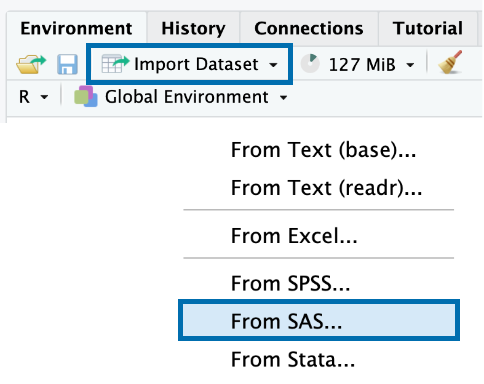
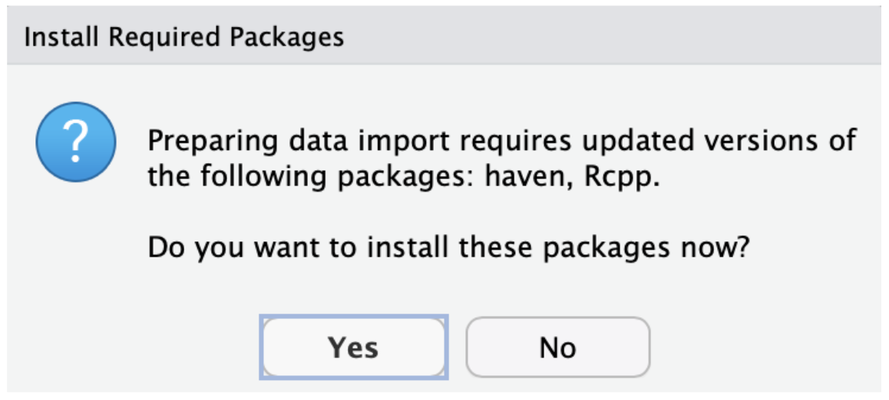
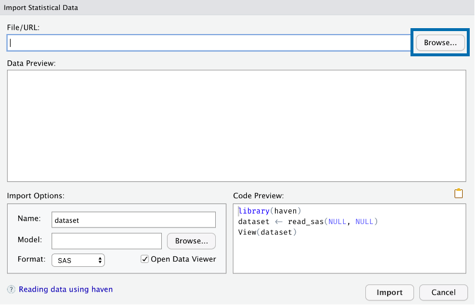
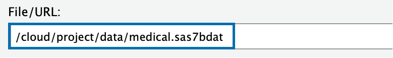
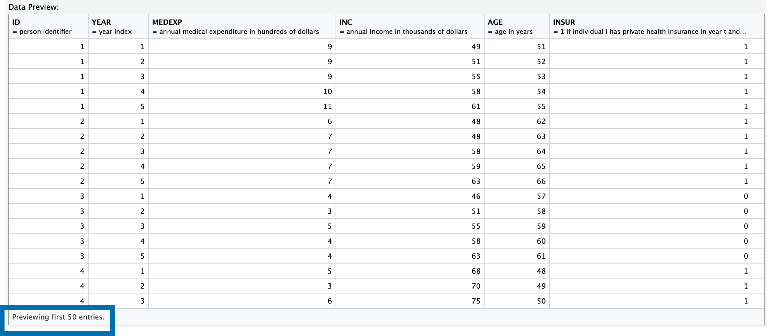
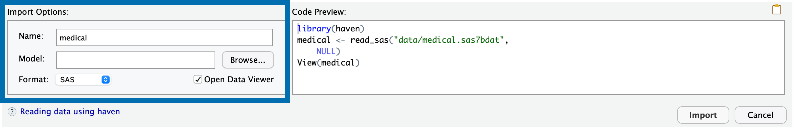
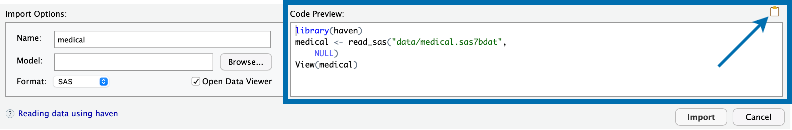
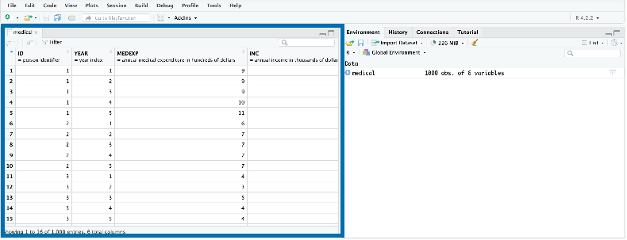
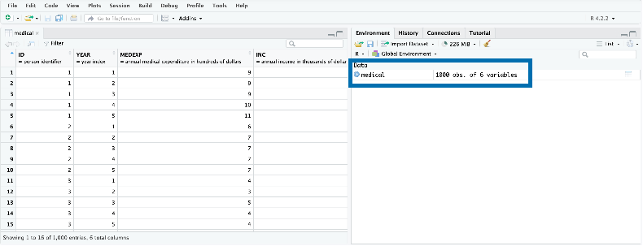

```{r meta, echo=FALSE}
library(metathis)
meta() |>
  meta_general(
    description = "Importing Data",
    generator = "xaringan and remark.js"
  ) |>
  meta_name("github-repo" = "paradigmdatagroup/import/") |>
  meta_social(
    title = "Importing Data",
    url = "https://github.com/paradigmdatagroup/importr/",
    og_type = "website",
    og_author = "Martin Frigaard",
    twitter_card_type = "summary",
    twitter_creator = "@mjfrigaard"
  )
```

```{r setup, include=FALSE}
dateWritten <- format(as.Date('2022-10-03'), format = "%B %d %Y")
today <- format(Sys.Date(), format = "%B %d %Y")
library(knitr)
library(rmarkdown)
library(fontawesome)
library(gtsummary)
options(
    htmltools.dir.version = FALSE,
    knitr.table.format = "html",
    knitr.kable.NA = ''
)
knitr::opts_chunk$set(
    warning = FALSE,
    message = FALSE,
    fig.path = "www/",
    fig.width = 7.252,
    fig.height = 4,
    comment = " ",
    fig.retina = 3 # Better figure resolution
)
# knitr::opts_knit$set(root.dir = 'slides/')
# Enables the ability to show all slides in a tile overview by pressing "o"
xaringanExtra::use_tile_view()
xaringanExtra::use_panelset()
xaringanExtra::use_clipboard()
xaringanExtra::use_share_again()
xaringanExtra::style_share_again(share_buttons = "all")
xaringanExtra::use_extra_styles(
  hover_code_line = TRUE,
  mute_unhighlighted_code = FALSE
)
```

layout: true

<!-- this adds the link footer to all slides, depends on footer-small class in css-->

<div class="footer-small"><span>https://github.com/paradigmdatagroup/pdg/</div>

---
name: title-slide
class: title-slide, center, middle, inverse

# `r rmarkdown::metadata$title`
#.fancy[`r rmarkdown::metadata$subtitle`]

<br>

.large[by Martin Frigaard]

Written: `r dateWritten`

Updated: `r today`

.footer-small[.right[.fira[
<br><br><br><br><br>[Created using the "λέξις" theme](https://jhelvy.github.io/lexis/index.html#what-does-%CE%BB%CE%AD%CE%BE%CE%B9%CF%82-mean)
]]]

---
background-image: url(www/pdg-hex.png)
background-position: 96% 4%
background-size: 6%

# Outline

.leftcol[

- Packages for importing data 

- Importing data using the IDE 

- Making import steps reproducible

- `worksheets/import.Rmd`

]

--

.rightcol[

- Importing data from local 

- Downloading data from the web

- Importing data using parameters (`params`) 

- Importing multiple data files 


]

---
background-image: url(www/pdg-hex.png)
background-position: 96% 4%
background-size: 6%

# Materials 

The slides are in the `slides.pdf` file

--

<br>

The materials for this training are in the `worksheets` folder: 

```
worksheets/
    └── import.Rmd
```

---
background-image: url(www/pdg-hex.png)
class: center, middle, inverse
background-position: 96% 4%
background-size: 6%

# .large[Import Data] 

--

<br><br>

.font90[.green[Open `import.Rmd` to follow along]]


---
background-image: url(www/pdg-hex.png)
class: left, top
background-position: 96% 4%
background-size: 6%

# Importing Data 

### Packages for importing data:


| File type                           | Package                        |
|-------------------------------------|--------------------------------|
| SAS (`.sas7bdat`)                   | `haven`                        |
| Excel (`.xlsx`, `.xls`)             | `readxl`, `openxlsx`           |
| Plain Text (`.csv`, `.tsv`, `.txt`) | `readr`, `vroom`, `data.table` |


---
background-image: url(www/pdg-hex.png)
class: left, top
background-position: 96% 4%
background-size: 6%

# Importing Data (*Environment*)

#### The .blue[Environment] Pane

```{r rstudio-env.png, echo=FALSE, out.height='100%', out.width='100%'}
knitr::include_graphics("www/rstudio-env.png")
```

---
background-image: url(www/pdg-hex.png)
class: left, top
background-position: 96% 4%
background-size: 6%

# Importing Data (*Import Dataset*)

.leftcol[

#### Click .blue[Import Dataset]

#### Click .blue[From SAS]

]

.rightcol[

```{r rstudio-import-dataset, fig.align='left', echo=FALSE, out.height='100%', out.width='100%'}

```

]

---
background-image: url(www/pdg-hex.png)
class: left, top
background-position: 96% 4%
background-size: 6%

# Importing Data (*Required Packages*)

#### If you see a prompt to install required packages, click .blue[Yes]

```{r rstudio-dep-pkgs, fig.align='center', echo=FALSE, out.height='60%', out.width='60%'}

```

---
background-image: url(www/pdg-hex.png)
class: left, top
background-position: 96% 4%
background-size: 6%

# Importing Data (*Dialogue Box*)

.leftcol20[

.font80[**You will see the .blue[Import Statistical Data] Dialogue Box**]

.font80[**Click .blue[Browse] and navigate to the `data/medical.sas7bdat` file**]

]

.rightcol80[

```{r rstudio-import-dialogue-01, fig.align='right', echo=FALSE, out.height='80%', out.width='80%'}

```

]

---
background-image: url(www/pdg-hex.png)
class: left, top
background-position: 96% 4%
background-size: 6%

# Importing Data (*Dialogue Box*)

.leftcol20[

.font80[**You will see the path in .blue[File/URL]**]

.font80[**A preview of the data will appear in .blue[Data Preview] **]

]

.rightcol80[

```{r rstudio-import-dialogue-02, fig.align='right', echo=FALSE, out.height='70%', out.width='70%'}

```

```{r rstudio-import-dialogue-03, fig.align='right', echo=FALSE, out.height='90%', out.width='90%'}

```

]

---
background-image: url(www/pdg-hex.png)
class: left, top
background-position: 96% 4%
background-size: 6%

# Importing Data (*Dialogue Box*)


.font90[**You see we have additional .blue[Import Options]**]

```{r rstudio-import-dialogue-04, fig.align='right', echo=FALSE, out.height='90%', out.width='90%'}

```

--

.font90[**We also see a .blue[Code Preview]. Click on the small copy icon, then click .blue[Import]**]

```{r rstudio-import-dialogue-05, fig.align='right', echo=FALSE, out.height='90%', out.width='90%'}

```


---
background-image: url(www/pdg-hex.png)
class: left, top
background-position: 96% 4%
background-size: 6%

# Importing Data (*Data Viewer*)

.font90[**RStudio imports the data and opens it in the .blue[Data Viewer]**]

```{r rstudio-import-dialogue-06, fig.align='right', echo=FALSE, out.height='100%', out.width='100%'}

```

---
background-image: url(www/pdg-hex.png)
class: left, top
background-position: 96% 4%
background-size: 6%

# Importing Data (*Data Viewer*)

.font90[**We can also see `medical` has been added to our .blue[Environment] pane**]

```{r rstudio-import-dialogue-07, fig.align='right', echo=FALSE, out.height='95%', out.width='95%'}

```

---
background-image: url(www/pdg-hex.png)
class: left, top
background-position: 96% 4%
background-size: 6%

# Importing Data 

--

<br>

### .font120[Is what we did reproducible?]

--

<br>

.font120[***.red[No, but it can be!]***]

--

<br>

.font120[Open `import.Rmd` from the `worksheets` folder]

---
background-image: url(www/pdg-hex.png)
class: left, top
background-position: 96% 4%
background-size: 6%

# Importing Data 


.leftcol20[

In `Import.Rmd` 

- Instructions inside `#` boxes won't run

- Fill in `author` and `date` (inside quotes)

]

.rightcol80[

```{r import-instructions, fig.align='right', echo=FALSE, out.height='75%', out.width='75%'}
knitr::include_graphics("www/import-instructions.png")
```

]

---
background-image: url(www/pdg-hex.png)
class: left, top
background-position: 96% 4%
background-size: 6%

# Importing Data (from local)

We already have the code to import `medical.sas7bdat` from local

```{r rstudio-import-dialogue-05-02, fig.align='right', echo=FALSE, out.height='90%', out.width='90%'}

```

--

We need to adjust the file path to `../data/medical.sas7bdat`

.leftcol[

.code70[

```
. # importing with dialogue
└── data/
      └── medical.sas7bdat
```

]
]

.rightcol[

.code70[

```
. # importing from file
├── data/
│   └──  medical.sas7bdat
└── worksheets/
    └──  import.Rmd
```

]
]

---
background-image: url(www/pdg-hex.png)
class: left, top
background-position: 96% 4%
background-size: 6%

# Importing Data (download and import)

<br>

We can also download the file from a `url`

.code70[

```{r download.file-url, eval=FALSE}
download.file(
    url = "http://www.principlesofeconometrics.com/sas/medical.sas7bdat", #<<
    )
```

]

--

And save this to a local `destfile`

.code70[

```{r download.file-deestfile, eval=FALSE}
download.file(
    url = "http://www.principlesofeconometrics.com/sas/medical.sas7bdat", 
    destfile = "../data/downloads/medical.sas7bdat") #<<
```

]

---
background-image: url(www/pdg-hex.png)
class: left, top
background-position: 96% 4%
background-size: 6%

# Importing Data (download and import)

<br>

.font120[Now we can import the file from our `downloads/` folder]

.leftcol35[

.code60[

```
. # importing from downloads folder
├── data/
│   ├── medical.sas7bdat
│   └── downloads/
│            └── medical.sas7bdat
└── worksheets/
    └── import.Rmd
```

]

]


.rightcol65[

<br>

.code70[

```{r import-from-destfile, eval=FALSE}
medical <- read_sas("../data/downloads/medical.sas7bdat") 
```

]


]

---
background-image: url(www/pdg-hex.png)
class: left, top
background-position: 96% 4%
background-size: 6%

# Importing Data (parameters)

.font90[For a more permanent solution, we can use parameters in our R Markdown file to store file location (or other metadata)]

.code70[

```yaml
title: "May Report"
author: "Joe Smith"
date: "2022-11-30"
output: html_document

params:
  sas_data_url: !r file.path("http://www.principlesofeconometrics.com/sas/medical.sas7bdat")
  sas_data_dir: !r c("../data/sas/")
```

]

--

.code70[
```{r params-example-01, eval=FALSE}
download.file(url = params$sas_data_url, #<<
    )
```
]

--

.code70[

```{r params-example-02, eval=FALSE}
download.file(url = params$sas_data_url, 
    destfile = params$sas_data_dir) #<<
```

]

---
background-image: url(www/pdg-hex.png)
class: left, top
background-position: 96% 4%
background-size: 6%

# Importing Data (multiple files)

If we have a folder with multiple files, we can reduce duplicated code with iteration. 

--

.leftcol[
.code80[

```
. # importing multiple files
├── data/sas/
│   ├── elemapi-2000.sas7bdat
│   ├── elemapi2-2000.sas7bdat
│   ├── hsb2.sas7bdat
│   └── nations.sas7bdat
└── worksheets/
    └── import.Rmd
```

]
]

--

.rightcol[

.code80[

```{r import-map, eval=FALSE}
# create vector of files
sas_filenames <- list.files(
            path = "../data/sas", 
            full.names = TRUE)
all_sas_data <- sas_filenames |> 
    # give this vector names
    purrr::set_names() |> 
    # use read_sas() on all files
    purrr::map(.x = , .f = read_sas)
```

]

.font90[`all_sas_data` is a list of datasets]

]

---
background-image: url(www/pdg-hex.png)
class: left, top
background-position: 96% 4%
background-size: 6%

# Importing Data (multiple files)


.font90[Each named according to their path in `data/sas/`]

.code55[

```{r , eval=FALSE}
str(all_sas_data)
# $ ../data/sas/elemapi-2000.sas7bdat : tibble [400 × 21] (S3: tbl_df/tbl/data.frame) #<<
#   ..$ snum    : num [1:400] 906 889 887 876 888 ...
#   .. ..- attr(*, "label")= chr "school number"
#   ..$ dnum    : num [1:400] 41 41 41 41 41 98 98 108 108 108 ...
#   .. ..- attr(*, "label")= chr "district number"
#   .. [list output truncated]
#  $ ../data/sas/elemapi2-2000.sas7bdat: tibble [400 × 22] (S3: tbl_df/tbl/data.frame) #<<
#   ..$ snum    : num [1:400] 906 889 887 876 888 ...
#   .. ..- attr(*, "label")= chr "school number"
#   ..$ dnum    : num [1:400] 41 41 41 41 41 98 98 108 108 108 ...
#   .. ..- attr(*, "label")= chr "district number"
#   .. [list output truncated]
#  $ ../data/sas/hsb2.sas7bdat         : tibble [200 × 11] (S3: tbl_df/tbl/data.frame) #<<
#   ..$ id     : num [1:200] 3 5 16 35 8 19 6 1 4 22 ...
#   ..$ female : num [1:200] 0 0 0 1 1 1 1 1 1 0 ...
#   .. [list output truncated]
#  $ ../data/sas/nations.sas7bdat      : tibble [109 × 15] (S3: tbl_df/tbl/data.frame) #<<
#   ..$ country : chr [1:109] "Algeria" "Argentin" "Australi" "Austria" ...
#   .. ..- attr(*, "label")= chr "Country"
#   ..$ pop     : num [1:109] 21.9 30.5 15.8 7.6 100.6 ...
#   .. ..- attr(*, "label")= chr "1985 population in millions"
#   .. [list output truncated]
```

]

---
background-image: url(www/pdg-hex.png)
class: left, top
background-position: 96% 4%
background-size: 6%

# Recap 

.leftcol[

.font120[Packages for importing common data files:]

-   `haven`, `readxl`, `openxlsx`, `vroom`, or `data.table`

.font120[Making import steps reproducible:]

- Store in sequentially named script (i.e, `01-import.R`), in R Markdown chunk or R Markdown parameter

]

.rightcol[

.font120[Use iteration to import/export multiple files:]

```r
# create vector of files paths
data_filenames <- list.files(
            path = "path/to/data", 
            full.names = TRUE)
all_data <- data_filenames |> 
    # give this vector names
    purrr::set_names() |> 
    # use read_*() function all files
    purrr::map(.x = , .f = read_*)
```


]

---
background-image: url(www/pdg-hex.png)
class: left, top
background-position: 96% 4%
background-size: 6%

# More resources

.font120[

- [Data import cheatsheet](https://github.com/rstudio/cheatsheets/blob/main/data-import.pdf)

- [Data import section of R for data science](https://r4ds.hadley.nz/data-import.html) 

- [`readxl` package website](https://readxl.tidyverse.org/) (and [workflows](https://readxl.tidyverse.org/articles/readxl-workflows.html))

- [`haven` package website](https://haven.tidyverse.org/)

- [`readr` package website](https://readr.tidyverse.org/)

]
