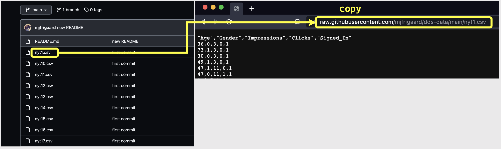
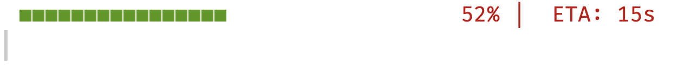

```{r meta, echo=FALSE}
library(metathis)
meta() |>
  meta_general(
    description = "Introduction to iteration",
    generator = "xaringan and remark.js"
  ) |>
  meta_name("github-repo" = "paradigmdatagroup/iteration/") |>
  meta_social(
    title = "Common Data Objects in R",
    url = "https://github.com/paradigmdatagroup/iteration/",
    og_type = "website",
    og_author = "Martin Frigaard",
    twitter_card_type = "summary",
    twitter_creator = "@mjfrigaard"
  )
```

```{r setup, include=FALSE}
dateWritten <- format(as.Date('2022-01-09'), format = "%B %d %Y")
today <- format(Sys.Date(), format = "%B %d %Y")
library(knitr)
library(rmarkdown)
library(fontawesome)
options(
    htmltools.dir.version = FALSE,
    knitr.table.format = "html",
    knitr.kable.NA = ''
)
knitr::opts_chunk$set(
    warning = FALSE,
    message = FALSE,
    fig.path = "figs/",
    fig.width = 7.252,
    fig.height = 4,
    comment = "#>",
    fig.retina = 3 # Better figure resolution
)
source("utils.R")
mixed_list <- make_mixed_list()
```

```{r xaringanExtra, include=FALSE}
# Enables the ability to show all slides in a tile overview by pressing "o"
xaringanExtra::use_tile_view()
xaringanExtra::use_panelset()
xaringanExtra::use_clipboard()
xaringanExtra::use_share_again()
xaringanExtra::style_share_again(share_buttons = "all")
xaringanExtra::use_extra_styles(
  hover_code_line = TRUE,
  mute_unhighlighted_code = FALSE
)
```

layout: true

<!-- this adds the link footer to all slides, depends on footer-small class in css-->

<div class="footer-small"><span>https://github.com/paradigmdatagroup/iteration</span></div>

---
name: title-slide
class: title-slide, center, middle, inverse

# `r rmarkdown::metadata$title`
#.fancy[`r rmarkdown::metadata$subtitle`]

<br>

.large[by Martin Frigaard]

Written: `r dateWritten`

Updated: `r today`

---
class: left, top
background-image: url(img/purrr.png)
background-position: 90% 7%
background-size: 7%

# Outline

.leftcol[

#### When to use iteration

- Iteration & the DRY principle

#### Base R 

- `for` loops

- Anonymous functions

- the `apply` family

]

--

.rightcol[

#### `purrr`

- A `purrr` template

- `map()` variants 

- Formula syntax

#### Worked examples 

- Dealing with multiple datasets

]


---
class: inverse, center, middle
background-position: 50% 50%

# .font180[*What is iteration?*]

---
class: left, top
background-image: url(img/R_logo.png)
background-position: 90% 7%
background-size: 7%

# What is iteration?

<br>

In programming, iteration refers to .font110[.red[*defining an input and applying an operation over every part.*]]

--

> .font140["...across each of these, do this...”]

---
class: left, top
background-image: url(img/R_logo.png)
background-position: 90% 7%
background-size: 7%

# How iteration works

--

### The number of 'iterations' can be based on conditions, a set number, or via the number of elements in an object. 

I like to this of iteration as, 

.center[
> ## "*versatile repetitive execution at scale*"
]


---
class: left, top
background-image: url(img/R_logo.png)
background-position: 90% 7%
background-size: 7%

# When to use iteration?

If the **.blue[DRY]** principle is violated:

--

> .font140[*"Every piece of knowledge or logic should have a single, authoritative representation within a system."* - **.blue[D]**on't **.blue[R]**epeat **.blue[Y]**ourself  ([Wikipedia](https://en.wikipedia.org/wiki/Don't_repeat_yourself?oldformat=true))]

--

When you find yourself copying and pasting code in multiple places, consider writing a function or using iteration


---
class: left, top
background-image: url(img/R_logo.png)
background-position: 90% 7%
background-size: 7%

# Problems to solve with iteration


.leftcol[

- **Problems involving repetition**

  - Perform an operation needs on each element in a dataset
  
- **Problems involving conditional calculations**

  - Execute a set of calculations until a specific condition is met

]

--

.rightcol[

- **Any combination of the two**

- Repeat an operation (or a set of operations) a certain number of times or until a specific condition is met

]

---
class: left, top
background-image: url(img/R_logo.png)
background-position: 90% 7%
background-size: 7%

# Methods for iteration in R

<br>

--


### 1. `for` loops (base R)

--

### 2. `apply` family of functions (base R)


--

### 3. `purrr` (`tidyverse`)


---
class: inverse, center, middle
background-position: 50% 50%

# .font180[*The `for` loop*]

---
class: left, top
background-image: url(img/R_logo.png)
background-position: 90% 7%
background-size: 7%

# The `for` loop structure

--

### `for` loops are composed in three parts:

--

.leftcol[

#### 1. A sequence to index

#### 2. Operation(s) to iterate

#### 3. An object to capture the results

]

--

.rightcol[

.code65[

```{r, eval=FALSE}
# build output to capture result
output <- structure(list(words = NULL, 
                         sentences = NULL, 
                         letters = NULL))
# define sequence
for (variable x in my_list) {
  # list operation(s) to be repeated
  output[[x]] <- function(my_list[[x]])
}
```

]

]

---
class: left, top
background-image: url(img/R_logo.png)
background-position: 90% 7%
background-size: 7%

# The `for` loop example

.leftcol[

Build a list 

.code60[
```{r , echo=TRUE}
my_list <- list(
  words = c("bLOW", "FOLloW", "cOMMOn", 
            "ORiginAL", "UsUal"),
  sentences = c(
    "HE TaKeS tHE oatH OF offICe EaCH mArcH.",
    "THE OfficE pAINt waS A dUll, saD TAn.",
    "faRMers CAmE iN TO ThREsH tHe OAT crOP."
  ),
  letters = c("l", "y", "d", "p", "h", 
              "e", "v", "M", "R", "Z")
) 
```
]

]

--

.rightcol[

View it's structure 

.code60[
```{r}
my_list
```
]


]


---
class: left, top
background-image: url(img/R_logo.png)
background-position: 90% 7%
background-size: 7%

# The `for` loop example

--

### Apply a function to every element of a list

--

*What happens when we pass `my_list` to `tolower()`?*

--

```{r}
tolower(x = my_list)
```

--

*Yikes!* 

---
class: left, top
background-image: url(img/R_logo.png)
background-position: 90% 7%
background-size: 7%

# The `for` loop example

*What happened?*

--

```{r , eval=FALSE}
??tolower
```

> *"`x` = a character vector, or an object that can be coerced to character"*

--

*`tolower()` was expecting `x` to be a vector*

---
class: left, top
background-image: url(img/R_logo.png)
background-position: 90% 7%
background-size: 7%

# The `for` loop example

<br>

A lot functions in R expect vectors, and a lot of vectors end up in lists...

--

*What we wanted:*

.code65[
```{r collapse=TRUE}
tolower(x = my_list$words)
tolower(x = my_list$sentences)
tolower(x = my_list$letters)
```
]

--

---
class: left, top
background-image: url(img/R_logo.png)
background-position: 90% 7%
background-size: 7%

## The `for` loop sequence

#### Use `seq_along()` to define the .red[sequence] to index:

--

.leftcol[

.code65[
```{r}
# This generates a full sequence for my_list
seq_along(my_list)
# This returns a single value of my_list
seq_along(my_list)[1]
```
]

]

--

.rightcol[

.code65[
```{r}
# This gets all items at index 1 in my_list
my_list[[seq_along(my_list)[1]]]
```
]

]

---
class: left, top
background-image: url(img/R_logo.png)
background-position: 90% 7%
background-size: 7%

## The `for` loop operations 

--

#### The .red[operations] are the functions the `for` loop will perform per iteration

--

*Test this with a few values*

--

.code65[

```{r}
tolower(my_list[[1]])
```

]

--

.code65[

```{r}
tolower(my_list[[3]])
```

]


---
class: left, top
background-image: url(img/R_logo.png)
background-position: 90% 7%
background-size: 7%

## The `for` loop capture object 

<br>

#### Define an object to capture the results of the loop

--

*Make sure `output_list` is the same size as `my_list`*

.code65[

```{r}
vector(mode = "list", length = 3)
```

]

---
class: left, top
background-image: url(img/R_logo.png)
background-position: 90% 7%
background-size: 7%

# The `for` loop 

--

#### Finally, we put it all together:

.code80[

```{r eval=TRUE}
# define capture object
output_list <- vector(mode = "list", length = 3)
# write sequence
for (x in seq_along(my_list)) {        
  # write operations/capture in object
  output_list[[x]] <- tolower(my_list[[x]])
}
```

]


---
class: left, top
background-image: url(img/R_logo.png)
background-position: 90% 7%
background-size: 7%

# The `for` loop 

--

#### The output:


.code80[
```{r echo=TRUE}
output_list
```

]


---
class: left, top
background-image: url(img/R_logo.png)
background-position: 90% 7%
background-size: 7%

# The `for` loop (clean up)

--

#### We can also clean up the output:

.leftcol[

Named vectors in `output_list`:

.code60[
```{r}
# define capture object
output_list <- vector(mode = "list", length = 3)
# write sequence
for (x in seq_along(my_list)) {        
  # write operations/capture in object
  output_list[[x]] <- tolower(my_list[[x]])
  # clean up container
  names(output_list) <- c("words", "sentences", "letters")
}
```

]

]

--

.rightcol[

.code60[
```{r echo=TRUE}
output_list
```

]

]

---
class: left, top
background-image: url(img/R_logo.png)
background-position: 90% 7%
background-size: 7%

# Recap `for` loops

1) Define the sequence to index

`for (` .red[x] `in seq_along(` .red[input_list] `))`

--

2) List the operations to iterate

.red[function]`(input_list[[x]])`

--

3) Build an object to capture the results

.red[output_list] `<- vector(mode = "list", length = length(input_list))` 

---
class: inverse, center
background-image: url(img/R_logo.png)
background-position: 50% 70%
background-size: 30%

# Anonymous functions

---
class: left, top
background-image: url(img/purrr.png)
background-position: 90% 7%
background-size: 7%

# Anonymous functions

- Anonymous functions are commonly used in iteration (`for` loops, `apply` functions, and `purrr`). R introduced a new shorthand anonymous function syntax in version [4.1.0](https://cran.r-project.org/doc/manuals/r-devel/NEWS.html):

--

.center[

> "*`\(x) x + 1` is parsed as `function(x) x + 1`*"

]


--

.leftcol[

Standard anonymous function:

.code65[

```{r}
(function(x) tolower(x))("pIrAtES Ship")
```

]

]

--

.rightcol[

New shorthand anonymous syntax:

.code65[

```{r}
(\(x) tolower(x))("pIrAtES Ship")
```

]

]

---
class: inverse, center
background-image: url(img/R_logo.png)
background-position: 50% 50%
background-size: 30%

# .font180[*The `apply` family*]


---
class: left, top
background-image: url(img/R_logo.png)
background-position: 90% 7%
background-size: 7%

# The `apply` functions

--

<br>

#### The base R `*apply` family of functions (`apply()`, `lapply()`, `sapply()`, `vapply()`, etc.) remove a lot of the ‘book keeping’ code in `for` loops

--

.leftcol35[

We'll focus on `lapply()` and `sapply()`

]

--

.rightcol65[

.code70[
```{r, eval=FALSE}
lapply(X, FUN, ...)

sapply(X, FUN, ..., simplify = TRUE, USE.NAMES = TRUE)
```
]

]


---
class: left, top
background-image: url(img/R_logo.png)
background-position: 90% 7%
background-size: 7%

# `lapply()` for lists

`lapply()` (pronounced ‘l-apply’) works with lists and has only two required arguments:

--

.leftcol40[

1. `X` the object we want to iterate over

2. `FUN` being the function we want iterated

]

--

.rightcol60[

.code70[
```{r}
lapply(X = my_list, FUN = tolower)
```
]

]

---
class: left, top
background-image: url(img/R_logo.png)
background-position: 90% 7%
background-size: 7%

# `sapply()`

`sapply()` will attempt to `s`implify the result depending on the `X` argument:

--

.leftcol40[

If `X` is a list containing vectors where every element has the same length (and it’s greater than 1), then `sapply()` returns a matrix:


]

--

.rightcol60[

.code70[
```{r , collapse=FALSE}
str(my_list[1])
sapply(X = my_list[1], FUN = tolower)
```
]

]

---
class: left, top
background-image: url(img/R_logo.png)
background-position: 90% 7%
background-size: 7%

# `sapply()`

If a vector is passed to `X` where every element is length 1, then a vector is returned:

--

.code80[
```{r}
str(my_list[[1]])
```
]

--

.code80[
```{r , collapse=FALSE}
sapply(X = my_list[[1]], FUN = tolower) 
```
]

*Note the names are preserved* 


---
class: left, top
background-image: url(img/R_logo.png)
background-position: 90% 7%
background-size: 7%

# `sapply()`

<br>

Finally, if `X` is a list where elements have a length greater than 1, then `sapply()` returns a list (making it identical to `lapply()`)

--

```{r}
identical(x = sapply(X = my_list, FUN = tolower), 
          y = lapply(X = my_list, FUN = tolower))
```

--

This is because `sapply()` is a wrapper around `lapply()`, but has `simplify` and `USE.NAMES` set to `FALSE`

---
class: left, top
background-image: url(img/purrr.png)
background-position: 90% 7%
background-size: 7%

## Anonymous functions with `*apply` functions

If we were to write the examples above using anonymous functions, they would look like this: 

.leftcol[

.code65[

```{r}
identical(
  # standard 
  x = lapply(X = my_list, FUN = tolower),
  # anonymous shorthand
  y = my_list |> lapply(\(x) tolower(x))
)
```

]

]

--

.rightcol[

.code65[

```{r}
identical(
  # standard 
  x = sapply(X = my_list, FUN = tolower),
  # anonymous shorthand
  y = my_list |> sapply(\(x) tolower(x))
)
```

]


]


---
class: left, top
background-image: url(img/R_logo.png)
background-position: 90% 7%
background-size: 7%

# Recap `*apply()` functions


#### - The `*apply()` functions are more efficient than `for` loops because we can iterate over vectors *or* lists with **less code**

--

#### - One downside of `*apply` functions is they don’t play well with `data.frame`s or `tibble`s 

--

#### - `*apply` functions also aren't very uniform. Each function has slight variations in their arguments and rules for return values


---
class: inverse, center
background-image: url(img/purrr.png)
background-position: 50% 70%
background-size: 30%

# The `purrr` package


---
class: left, top
background-image: url(img/purrr.png)
background-position: 90% 7%
background-size: 7%

# `purrr` template

A great way to start using it’s functions is with the method covered in [Charlotte Wickham’s tutorial](https://posit.co/resources/videos/happy-r-users-purrr-tutorial/):

--

#### 1. Do it for one element

--

#### 2. Turn it into a recipe

--

#### 3. Use `purrr::map()` to do it for all elements

---
class: left, top
background-image: url(img/purrr.png)
background-position: 90% 7%
background-size: 7%

# `purrr` template: *do it for one element*

<br>

#### The goal with the first step is to get a minimal working example with a single element from the object you want to iterate over (with the function you want to iterate with)

--

.leftcol[

.code65[

```{r , eval=FALSE}
# subset an element from the list
? <- my_list[[?]]
# apply a function to extracted element
tolower(?)
```

]

]


--

.rightcol[

.code65[

```{r}
my_words <- my_list[['words']]
tolower(my_words)
```

]

]


---
class: left, top
background-image: url(img/purrr.png)
background-position: 90% 7%
background-size: 7%

# `purrr` template: *turn it into a recipe*

--

<br>

#### A standard `purrr` recipe defines `.x` (the object) and `.f` (the function), followed by any additional function arguments

--

```{r , eval=FALSE}
.x = my_list, .f = tolower
```

--

`.x` = a list or atomic vector

`.f` = the function we want to apply over every element in `.x`


---
class: left, top
background-image: url(img/purrr.png)
background-position: 90% 7%
background-size: 7%

## `purrr` template: *`map()` it across all elements*

--

#### The `.x` argument is the list or vector to iterate over, and `.f` is the function applied to every element of `.x`

--

.leftcol55[

.code80[

```{r , eval=FALSE}
purrr::map(.x = my_list, .f = tolower)
```


]

]

--

.rightcol45[

.code60[

```{r, echo=FALSE}
purrr::map(.x = my_list, .f = tolower)
```

]

]

---
class: left, top
background-image: url(img/purrr.png)
background-position: 90% 7%
background-size: 7%

# Anonymous functions with `purrr`

#### When using `purrr::map()`, the object can be 'piped' to an anonymous function 

--

.leftcol[

This...

.code70[

```{r , eval=FALSE}
purrr::map(.x = my_list, .f = tolower)
```

]

...becomes this

.code70[

```{r , eval=FALSE}
my_list |> purrr::map(\(x) tolower(x))
```

]

]

--

.rightcol[

.code65[

```{r}
# compare outputs
identical(
  # standard syntax
  x = purrr::map(.x = my_list, 
                  .f = tolower),
  # shorthand anonymous function
  y = my_list |> 
        purrr::map(\(x) tolower(x))
  )
```

]


]


---
class: inverse, center
background-image: url(img/purrr.png)
background-position: 50% 70%
background-size: 30%

# `map()` variants


---
class: left, top
background-image: url(img/purrr.png)
background-position: 90% 7%
background-size: 7%

# `map` vector functions

#### For vectors, `purrr` has a set of functions for each type

--

We’ll be using `mixed_list`--a list with five different types of vectors--to explore the `map()` vector functions:

--

.code65[

```{r}
mixed_list <- list(booleans = c(FALSE, TRUE, FALSE, TRUE),
    integers = c(3L, 4L, 2L, 9L, 1L),
    doubles = c(3.041, 2.735, 2.987, 3.044, 2.95),
    strings = c("true", "depend", "client", "equal", "round"),
    dates = structure(c(19453, 19413, 19363), class = "Date"))
```

]

--

.code65[

```{r}
mixed_list |> names()
```

]

---
class: left, top
background-image: url(img/purrr.png)
background-position: 90% 7%
background-size: 7%

# `map` vector functions

--

#### Test vectors in `mixed_list` by matching `is.<type>()` function

--

.leftcol[

-   .font90[ `map_lgl()` returns a logical vector ]

-   .font90[ `map_int()` returns an integer vector ]

-   .font90[ `map_dbl()` returns a double vector ]

]

--

.rightcol[

.code55[
```{r}
mixed_list |> purrr::map_lgl(\(x) is.logical(x))
mixed_list |> purrr::map_int(\(x) is.integer(x))
mixed_list |> purrr::map_dbl(\(x) is.double(x))
```
]


]


--

.font90[ *...note that `dates` are stored as `double` vectors*]

---
class: left, top
background-image: url(img/purrr.png)
background-position: 90% 7%
background-size: 7%

# `map` vector functions

#### Test vectors in `mixed_list` by matching `is.<type>()` function

--

`map_chr()` returns a character vector .red[with a `warning`]

--

```{r , eval=TRUE}
mixed_list |> purrr::map_chr(\(x) is.character(x))
```

--

```
#> Warning: Automatic coercion from logical to character was deprecated in purrr 1.0.0.
#> ℹ Please use an explicit call to `as.character()` within `map_chr()` instead.
#> Call `lifecycle::last_lifecycle_warnings()` to see where this warning was generated.
```


---
class: left, top
background-image: url(img/purrr.png)
background-position: 90% 7%
background-size: 7%

# `map_vec()` 

The previous `purrr::map_raw()` function has been replaced with `purrr::map_vec()`, which “*simplifies to the common type of the output*”

--

.code65[
```{r}
mixed_list |> purrr::map_vec(\(x) is.character(x))
```
]

--

Note that the results are no longer characters (in `"quotes"`). The same is true when I test the dates:

.code65[
```{r}
mixed_list |> purrr::map_vec(\(x) lubridate::is.Date(x))
```
]

---
class: inverse, center
background-image: url(img/purrr.png)
background-position: 50% 70%
background-size: 30%

# Worked Examples

---
class: left, top
background-image: url(img/purrr.png)
background-position: 90% 7%
background-size: 7%

# Iteration examples

Use cases I've continuously encountered and used iteration to solve: 

.leftcol[

**1) Downloading multiple files** 


- .font80[URLs might share a common domain, but varying paths:]


**2) Copying/renaming multiple files** 

.font80[

-   Batch rename and relocate files 

]


]

.rightcol[

**3) Importing multiple files**

.font80[

-   Import a local folder of data files into RStudio

]

**4) Exporting multiple objects**

.font80[

-   Export multiple objects from RStudio into unique file paths

]

]

.font70[
.footnote[
The files in these uses cases come from [Doing Data Science](https://github.com/oreillymedia/doing_data_science) by Cathy O’Neil and Rachel Schutt and are stored in [this repository.](https://github.com/oreillymedia/doing_data_science)
]
]


---
class: left, top
background-image: url(img/purrr.png)
background-position: 90% 7%
background-size: 7%

## Downloading files

> "*I need to download multiple files (from separate URLS)*" - [Link to Github repo](https://github.com/paradigmdatagroup/dds-data)

--

```{r , echo=FALSE}

```

---
class: left, top
background-image: url(img/purrr.png)
background-position: 90% 7%
background-size: 7%

## Downloading files

These files share a common domain, but have different file paths:

Step 1: Create unique URLS for one week (7) .csv files

- .darkblue[domain.com/].orange[path/to/file.csv]

.code65[
```{r}
# get example URL
nyt_url <- "https://raw.githubusercontent.com/mjfrigaard/dds-data/main/nyt1.csv"
# extract directory (i.e. common domain from URL)
nyt_dir_url <- fs::path_dir(nyt_url)
nyt_dir_url
```
]

---
class: left, top
background-image: url(img/purrr.png)
background-position: 90% 7%
background-size: 7%

## Downloading files

Step 1: Create unique URLS for the subset of .csv files

.code65[
```{r}
# create file names for 7th through 13th
nyt_file_nms <- paste0("nyt", 7:13, ".csv")
head(nyt_file_nms, 3)
# combine domain with file name
nyt_file_urls <- paste(nyt_dir_url, nyt_file_nms, sep = "/")
head(nyt_file_urls, 3)
```
]


---
class: left, top
background-image: url(img/purrr.png)
background-position: 90% 7%
background-size: 7%

## Downloading files

Step 2: Create unique local folder and file paths for the .csv files:

```{r}
nyt_local_dir <- "dds-nyt"
# create folder 
fs::dir_create(nyt_local_dir)
# create file paths 
nyt_local_pths <- paste(nyt_local_dir, nyt_file_nms, sep = "/")
head(nyt_local_pths)
```

---
class: left, top
background-image: url(img/purrr.png)
background-position: 90% 7%
background-size: 7%

## Downloading files

Step 3: Do it for one element of `nyt_file_urls` and `nyt_local_pths`:

--

<br>

.code80[

```{r , message=TRUE, eval=FALSE}
download.file(url = nyt_file_urls[1], destfile = nyt_local_pths[1])
```

]


--

```
trying URL 'https:/raw.githubusercontent.com/mjfrigaard/dds-data/main/nyt7.csv'
Content type 'text/plain; charset=utf-8' length 4856135 bytes (4.6 MB)
==================================================
downloaded 4.6 MB
```

--

`download.file()` comes with a progress bar (more on that later)

---
class: left, top
background-image: url(img/purrr.png)
background-position: 90% 7%
background-size: 7%

## Downloading files

We need a `purrr` function with the following arguments:

.leftcol[

1. `x` = An input vector of existing url paths 

2. `y` = The output vector of destination file paths 

3. Any additional arguments for `download.file()` 


]

--

.rightcol[

<br><br>

*For this problem, we don’t need to assign a return value to an object...we need a `purrr` function that will iterate over the items in `x` and write them to the new location in `y`*

]


---
class: left, top
background-image: url(img/purrr.png)
background-position: 90% 7%
background-size: 7%

## Downloading files

#### `walk()` is ideal for problems like this:

--

> '*`walk()` returns the input `.x` (invisibly)*' ...and... '*the return value of `.f()` is ignored*'

--

`invisibly` = the output from a function doesn't need to be assigned to an object

--

`walk2()` because we have the file URLS (`nyt_file_urls`) *and* the local file paths (`nyt_local_pths`)

---
class: left, top
background-image: url(img/purrr.png)
background-position: 90% 7%
background-size: 7%

## Downloading files

+ We will also add `.progress = TRUE` to view `purrr`s progress bar (and `quiet = TRUE` to silence the `download.file()` progress bar).

--

.code80[
```{r , eval=TRUE}
purrr::walk2(
  .x = nyt_file_urls, .y = nyt_local_pths, # inputs
  .f =  download.file, # function
  .progress = TRUE, quiet = TRUE # additional arguments
  )
```

]


--

```{r progress-gif, echo=FALSE, out.width='100%'}

```

.center[.font170[.darkgreen[.fancy[Progress bars!]]]]

---
class: left, top
background-image: url(img/purrr.png)
background-position: 90% 7%
background-size: 6%

## Copying a directory of files

> "*I have a folder of files I’d like to rename or copy to a new directory*"

.leftcol[

I just created this: 

```
dds-nyt/
    ├── nyt10.csv
    ├── nyt11.csv
    ├── nyt12.csv
    ├── nyt13.csv
    ├── nyt7.csv
    ├── nyt8.csv
    └── nyt9.csv
```


]

--

.rightcol[

but I'd like this: 

```
dds-nyt
    └── raw
        ├── nyt10.csv
        ├── nyt11.csv
        ├── nyt12.csv
        ├── nyt13.csv
        ├── nyt7.csv
        ├── nyt8.csv
        └── nyt9.csv
```

]


---
class: left, top
background-image: url(img/purrr.png)
background-position: 90% 7%
background-size: 6%

## Copying a directory of files

#### Create the new file paths


1) Store current file paths in vector 

.code60[
```{r}
# get file paths
file_pths <- list.files("dds-nyt", full.names = TRUE, pattern = ".csv$")
```
]

--

2) Do it for one (*replace the current path with desired folder*)

.code60[
```{r}
# do it for one
gsub(pattern = "^dds-nyt", replacement = "dds-nyt/raw", x = file_pths[1])
```
]


---
class: left, top
background-image: url(img/purrr.png)
background-position: 90% 7%
background-size: 7%

## Copying a directory of files

#### Create the new file paths

.leftcol35[

3) Write recipe 

.code65[
```{r, eval=FALSE}
# input
.x = file_pths, 
# function
.f = gsub,
# args 
pattern = "^dds-nyt",
replacement = "dds-nyt/raw"
```
]

]

.rightcol65[

`map_chr()` can apply `gsub()` across all `file_pths`

.code65[

```{r}
raw_file_pths <-  purrr::map_chr(
                      .x = file_pths, 
                      .f = gsub,
                      pattern = "^dds-nyt",
                      replacement = "dds-nyt/raw")
head(raw_file_pths, 2)
```

]

]

---
class: left, top
background-image: url(img/purrr.png)
background-position: 90% 7%
background-size: 7%

## Copying a directory of files

Now we're ready to copy the files 

.leftcol[

**1) Do it for one**

.code65[
```{r}
fs::dir_create("dds-nyt/raw")
# do it for one
fs::file_copy(
  path = file_pths[1], 
  new_path = raw_file_pths[1], 
  overwrite = TRUE)
fs::dir_tree("dds-nyt/raw", type = "any")
```

]
]


.rightcol[

**2) Write a recipe**

.code65[
```{r , eval=FALSE}
# inputs 
.x = file_pths, .y = raw_file_pths, 
# function and args
.f = fs::file_copy, overwrite = TRUE
```

]
]


---
class: left, top
background-image: url(img/purrr.png)
background-position: 90% 7%
background-size: 7%

## Copying a directory of files


#### `walk2()` it out!

.code75[
```{r eval=TRUE}
purrr::walk2(.x = file_pths, .y = raw_file_pths, 
      .f = fs::file_copy, 
      .progress = TRUE, overwrite = TRUE
  )
fs::dir_tree("dds-nyt/raw", type = "any")
```

]

---
class: left, top
background-image: url(img/purrr.png)
background-position: 90% 7%
background-size: 7%

## Copying a directory of files

#### What about the previous files in the parent `dds-nyt/` folder?

Supply the output from `list.files()` directly to `walk()` and include a pattern to matches `.csv` files

.cols3[
.code65[

```{r , echo=FALSE}
fs::dir_tree("dds-nyt/", type = "any", recurse = FALSE)
```

]
]

.cols3[
.code65[
```{r}
purrr::walk(
    # list CURRENT files 
    .x = list.files(
      path = "dds-nyt",
      pattern = ".csv$",
      full.names = TRUE),
    # map function
    .f = fs::file_delete)
```
]
]


.cols3[
.code65[
```{r, echo=FALSE}
fs::dir_tree("dds-nyt/", type = "any", recurse = TRUE)
```

]
]

---
class: left, top
background-image: url(img/purrr.png)
background-position: 90% 7%
background-size: 7%

## Import multiple datasets

> "*You’d like to import and combine several data files into a single dataset*"

.leftcol[

#### Do it for one

.code60[
```{r}
nyt1 <- vroom::vroom(
  file = raw_file_pths[1], 
  delim = ",", 
  show_col_types = FALSE)
```

]

]

.rightcol[

.code60[
```{r}
head(nyt1)
```

]


]

---
class: left, top
background-image: url(img/purrr.png)
background-position: 90% 7%
background-size: 7%

### Import multiple datasets: add wrangle function

Add hypothetical wrangling steps to make this example more realistic

.code47[
```{r}
nyt_data_processing <- function(nyt_csv) {
  orig_nms <- c("Age", "Gender", "Impressions", "Clicks", "Signed_In")
  nyt_nms <- names(nyt_csv)
  if (isFALSE(identical(x = orig_nms, y = nyt_nms))) {
    cli::cli_abort("these data don't have the correct columns!")
  } else {
    nyt_proc <- nyt_csv |> dplyr::mutate(age_group = dplyr::case_when( 
            # create age_group variable
              Age < 18 ~ "<18", Age >= 18 & Age < 30 ~ "18-30", Age >= 30 & Age < 45 ~ "30-44", 
              Age >= 45 & Age < 65 ~ "45-65", Age >= 65 ~ "65+"), 
          # factor age_group (ordered)
          age_group = factor(age_group, levels = c("<18", "18-30", "30-44", "45-65", "65+"), ordered = TRUE),
          # create CTR variable
          ctr_rate = round(x = Clicks/Impressions, digits = 3),
          # create new Female variable
          female = dplyr::case_when(Gender == 0 ~ "yes", Gender == 1 ~ "no", TRUE ~ NA_character_),
          # factor female (un-ordered)
          female = factor(female, levels = c("no", "yes")),
          Signed_In = dplyr::case_when(Signed_In == 0 ~ "no", Signed_In == 1 ~ "yes", TRUE ~ NA_character_),
          # factor Signed_In (un-ordered) & format columns
          Signed_In = factor(Signed_In, levels = c("no", "yes"))) |> janitor::clean_names() 
  }
  return(nyt_proc)
}
```
]

---
class: left, top
background-image: url(img/purrr.png)
background-position: 90% 7%
background-size: 7%

### Import multiple datasets: set names

Get vector of raw data paths and set names (`purrr::set_names()`)

.code70[

```{r}
raw_data_pths <- purrr::set_names(x = list.files(path = "dds-nyt/raw", 
                                                 pattern = ".csv$", 
                                                 full.names = TRUE))
raw_data_pths |> head(2) 
```

]

--

Setting names on the `raw_data_pths` vector will carry through to the imported list. 


---
class: left, top
background-image: url(img/purrr.png)
background-position: 90% 7%
background-size: 7%

### Import multiple datasets: import data

Add import function with `purrr::map()`

.code70[
```{r eval=FALSE}
# import 
purrr::map(
  .x = raw_data_pths, .f = vroom::vroom, delim = ",", show_col_types = FALSE) |> 
  # preview
  head(1) |> dplyr::glimpse()
```
]

Use `dplyr::glimpse()` to view the imported dataset in the list

---
class: left, top
background-image: url(img/purrr.png)
background-position: 90% 7%
background-size: 7%

### Import multiple datasets: import data (preview)

`dplyr::glimpse()` shows us the original column names have been imported:

.code65[
```{r echo=FALSE}
# import 
purrr::map(
  .x = raw_data_pths, .f = vroom::vroom, delim = ",", show_col_types = FALSE) |> 
  # preview
  head(1) |> dplyr::glimpse()
```
]


---
class: left, top
background-image: url(img/purrr.png)
background-position: 90% 7%
background-size: 7%

### Import multiple datasets: wrangle

Add wrangling function with `purrr::map()`

.code70[
```{r , eval=FALSE}
# import 
purrr::map(
  .x = raw_data_pths, .f = vroom::vroom, delim = ",", show_col_types = FALSE) |> 
  # wrangle 
  purrr::map(.f = nyt_data_processing) |> 
  # preview
  head(1) |> dplyr::glimpse()
```
]


---
class: left, top
background-image: url(img/purrr.png)
background-position: 90% 7%
background-size: 7%

### Import multiple datasets: wrangle (preview)

We can see the variables have been wrangled by the `nyt_data_processing()` function.

.code50[
```{r , echo=FALSE}
# import 
purrr::map(
  .x = raw_data_pths, .f = vroom::vroom, delim = ",", show_col_types = FALSE) |> 
  # wrangle 
  purrr::map(.f = nyt_data_processing) |> 
  # preview
  head(1) |> dplyr::glimpse(15)
```
]

 

---
class: left, top
background-image: url(img/purrr.png)
background-position: 90% 7%
background-size: 7%

### Import multiple datasets: bind

For the final step, I’ll bind all the data into a data.frame with the updated `purrr::list_rbind()` function (set `names_to = "id"`).

.code70[
```{r , eval=FALSE}
# import 
purrr::map(
  .x = raw_data_pths, .f = vroom::vroom, delim = ",", show_col_types = FALSE) |> 
  # wrangle 
  purrr::map(.f = nyt_data_processing) |> 
  # bind
  purrr::list_rbind(names_to = "id") |> 
  # preview
  dplyr::glimpse()
```
]

---
class: left, top
background-image: url(img/purrr.png)
background-position: 90% 7%
background-size: 7%

### Import multiple datasets: bind (preview)

We can see the datasets from `dds-nyt/raw/` have been imported and processed. 

.code65[
```{r , echo=FALSE}
# import 
purrr::map(
  .x = raw_data_pths, .f = vroom::vroom, delim = ",", show_col_types = FALSE) |> 
  # wrangle 
  purrr::map(.f = nyt_data_processing) |> 
  # bind
  purrr::list_rbind(names_to = "id") |> 
  # preview
  dplyr::glimpse(74)
```
]

---
class: left, top
background-image: url(img/purrr.png)
background-position: 90% 7%
background-size: 7%

### Import multiple datasets: assign

Assign the imported/wrangled data to `nyt_data_proc`

.leftcol55[

.code65[
```{r}
# store 
nyt_data_proc <- purrr::map(
    # import 
    .x = raw_data_pths, 
    .f = vroom::vroom, 
    delim = ",", 
    show_col_types = FALSE) |> 
    # wrangle 
  purrr::map(
    .f = nyt_data_processing) |> 
    # bind
  purrr::list_rbind(names_to = "id")
```
]

`id` contains the name of the original file. 

]

--

.rightcol45[

.code65[
```{r}
nyt_data_proc |> dplyr::count(id)
```
]

]


---
class: left, top
background-image: url(img/purrr.png)
background-position: 90% 7%
background-size: 7%

## Export multiple datasets

> *"You’d like to split your data on a categorical variable into individual datasets, then export these into separate file paths"*

--

Now that we've imported and wrangled the data, we want to export these to a different location (i.e., `dds-nyt/processed/`) and not back in `dds-nyt/raw/`.

--

Creating a vector of processed data file paths is a little more involved because I wanted to add a date prefix to the exported files, and because I want to add this path as *a variable in the `nyt_data_proc` dataset*.


---
class: left, top
background-image: url(img/purrr.png)
background-position: 90% 7%
background-size: 7%

### Export multiple datasets: add processed file names 

Below I create `file_nm` and `proc_file_pth`

.code65[
```{r , eval=FALSE}
# create file names 
nyt_data_proc <- dplyr::mutate(.data = nyt_data_proc,
        file_nm = tools::file_path_sans_ext(base::basename(id)),
        proc_file_pth = paste0("dds-nyt/processed/", as.character(Sys.Date()), "-", file_nm))
nyt_data_proc |> dplyr::count(proc_file_pth)
```
]

.code60[
```{r , echo=FALSE}
nyt_data_proc <- dplyr::mutate(.data = nyt_data_proc,
        file_nm = tools::file_path_sans_ext(base::basename(id)),
        proc_file_pth = paste0("dds-nyt/processed/", as.character(Sys.Date()), "-", file_nm))
nyt_data_proc |> dplyr::count(proc_file_pth)
```
]

--

---
class: left, top
background-image: url(img/purrr.png)
background-position: 90% 7%
background-size: 7%

### Export multiple datasets: method 1

Note that I don’t include the file extension in `proc_file_pth` (*because I might want to use different file types when I’m exporting*).

--

In this first method, I’ll use the `base::split()` function to split `nyt_data_proc` by the `proc_file_pth` variable into a list of data frames. I’ll also use `utils::head()`, `purrr::walk()`, and `dplyr::glimpse()` to view the output.

--


```{r , eval=FALSE}
split(x = nyt_data_proc, f = nyt_data_proc$proc_file_pth) |>
  utils::head(2) |> 
  purrr::walk(.f = dplyr::glimpse)
```


---
class: left, top
background-image: url(img/purrr.png)
background-position: 90% 7%
background-size: 7%

### Export multiple datasets: method 1 (preview)

.code50[
```{r , echo=FALSE}
split(x = nyt_data_proc, f = nyt_data_proc$proc_file_pth) |>
  utils::head(2) |> 
  purrr::walk(.f = dplyr::glimpse)
```
]

---
class: left, top
background-image: url(img/purrr.png)
background-position: 90% 7%
background-size: 7%

### Export multiple datasets: method 1 (prep)

Pass list to `purrr::walk2()` and iterate `vroom::vroom_write()` over processed data paths (`proc_file_pth`)

--

.leftcol[

.font80[ 1) create processed data folder ]

.code65[

```{r}
fs::dir_create("dds-nyt/processed/")
```

]

.font80[ 2) create the `.x`, the split list of `nyt_data_proc` by `proc_file_pth` ]

.code65[

```{r}
by_proc_pths <- nyt_data_proc |> 
  split(nyt_data_proc$proc_file_pth)
```

]

]

--

.rightcol[

.font80[ 3) get unique processed data paths in `proc_file_pth` column and store as vector `.y` ]

.code65[

```{r}
proc_pths <- paste0(unique(nyt_data_proc$proc_file_pth), ".csv")
```

]

]


---
class: left, top
background-image: url(img/purrr.png)
background-position: 90% 7%
background-size: 7%

### Export multiple datasets: method 1 (export)

I can export the data to `proc_pths` using the standard syntax:

.code65[
```{r}
# iterate with .f
purrr::walk2(.x = by_proc_pths, .y = proc_pths, .f = vroom::vroom_write, delim = ",")
```
]

--

Or with pipes as an anonymous function:

.code65[
```{r}
nyt_data_proc |> 
  split(nyt_data_proc$proc_file_pth) |> 
  purrr::walk2(.y = proc_pths, 
    \(x, y)
    vroom::vroom_write(x = x, 
      file = y,  delim = ","))
```
]

---
class: left, top
background-image: url(img/purrr.png)
background-position: 90% 7%
background-size: 7%

### Export multiple datasets: verify

```{r}
fs::dir_tree("dds-nyt/", pattern = "csv$")
```


---
class: left, top
background-image: url(img/purrr.png)
background-position: 90% 7%
background-size: 7%

### Export multiple datasets: option 2

Another option involves the `group_walk()` function from `dplyr` (**WARNING**: this is experimental).

.code65[
```{r , eval=FALSE}
nyt_data_proc |> 
  dplyr::group_by(proc_file_pth) |>   
  dplyr::group_walk( ~vroom::vroom_write(x = .x, 
                          file = paste0(.y$proc_file_pth, ".csv"),
                          delim = ","))
```
]

--

Re-written as an anonymous function, this would look like:

.code65[
```{r , eval=FALSE}
nyt_data_proc |> 
  dplyr::group_by(proc_file_pth) |>   
  dplyr::group_walk(\(x, y) 
    vroom::vroom_write(
    x = x, file = paste0(y$proc_file_pth, ".csv"), delim = ", "))
```
]


---
class: left, top
background-image: url(img/purrr.png)
background-position: 90% 7%
background-size: 7%

# Recap 

.leftcol[

- Iteration
  - What is iteration & what kinds of problems it can solve

- Base R 
  - The structure of `for` loops & the `apply` family
      - New shorthand anonymous function syntax

]

--

.rightcol[

- `purrr`
  - Creating a `purrr` template
  - `map()` variants (`map_vec()`)

- Worked examples 
  - Dealing with multiple datasets
      - Downloading 
      - Copying 
      - Importing 
      - Exporting 

]

---
class: left, top
background-image: url(img/purrr.png)
background-position: 90% 7%
background-size: 7%

# Read more

<br> 

- [`purrr` package website](https://purrr.tidyverse.org/) 

- [Iteration chapter in R for data science](https://r4ds.hadley.nz/iteration.html) 

- [`purrr` version 1.0 blog post](https://www.tidyverse.org/blog/2022/12/purrr-1-0-0/) and [video from Posit](https://www.youtube.com/watch?v=EGAs7zuRutY) 

```{r, echo=FALSE}
fs::dir_delete("dds-nyt/raw")
# fs::dir_delete("dds-nyt/processed/")
fs::dir_delete("dds-nyt")
```

