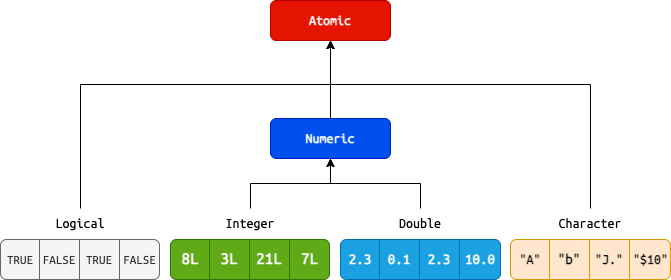
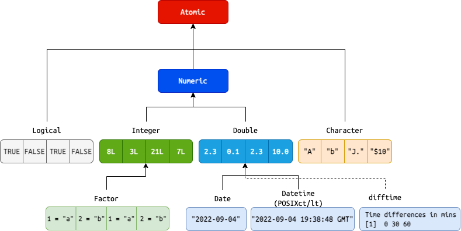
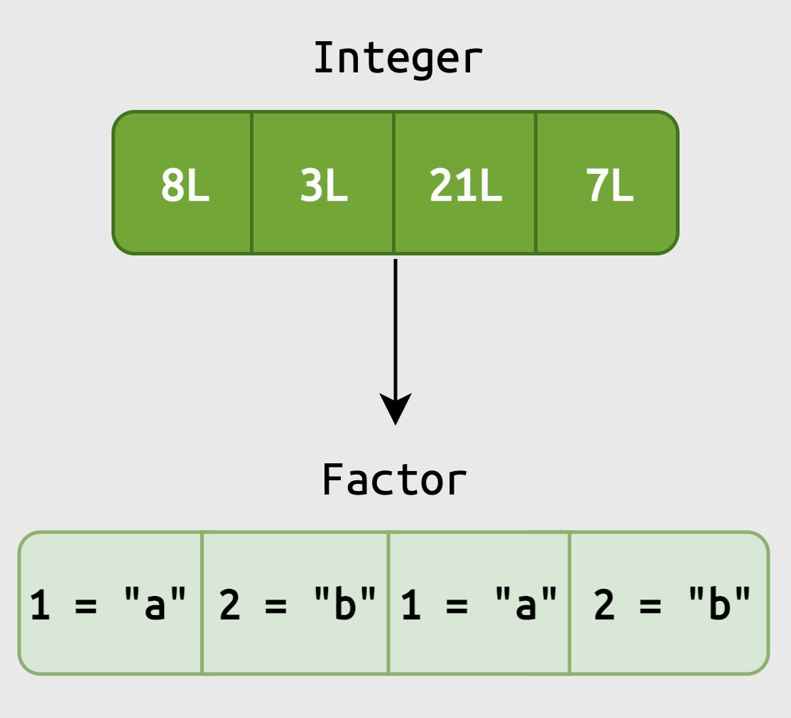
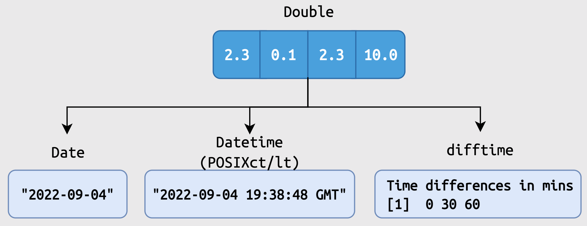

```{r meta, echo=FALSE}
library(metathis)
meta() |>
  meta_general(
    description = "Common Data Objects in R",
    generator = "xaringan and remark.js"
  ) |>
  meta_name("github-repo" = "paradigmdatagroup/objects/") |>
  meta_social(
    title = "Common Data Objects in R",
    url = "https://github.com/paradigmdatagroup/objects/",
    og_type = "website",
    og_author = "Martin Frigaard",
    twitter_card_type = "summary",
    twitter_creator = "@mjfrigaard"
  )
```

```{r setup, include=FALSE}
dateWritten <- format(as.Date('2022-10-03'), format = "%B %d %Y")
today <- format(Sys.Date(), format = "%B %d %Y")
library(knitr)
library(rmarkdown)
library(fontawesome)
library(gtsummary)
options(
    htmltools.dir.version = FALSE,
    knitr.table.format = "html",
    knitr.kable.NA = ''
)
knitr::opts_chunk$set(
    warning = FALSE,
    message = FALSE,
    fig.path = "img/",
    fig.width = 7.252,
    fig.height = 4,
    comment = " ",
    fig.retina = 3 # Better figure resolution
)
# Enables the ability to show all slides in a tile overview by pressing "o"
xaringanExtra::use_tile_view()
xaringanExtra::use_panelset()
xaringanExtra::use_clipboard()
xaringanExtra::use_share_again()
xaringanExtra::style_share_again(share_buttons = "all")
xaringanExtra::use_extra_styles(
  hover_code_line = TRUE,
  mute_unhighlighted_code = FALSE
)
```

layout: true

<!-- this adds the link footer to all slides, depends on footer-small class in css-->

<div class="footer-small"><span>https://github.com/paradigmdatagroup/objects/</div>

---
name: title-slide
class: title-slide, center, middle, inverse

# `r rmarkdown::metadata$title`
#.fancy[`r rmarkdown::metadata$subtitle`]

<br>

.large[by Martin Frigaard]

Written: `r dateWritten`

Updated: `r today`


---
background-image: url(img/pdg-hex.png)
background-position: 96% 4%
background-size: 6%

# Materials 

The slides are in the `slides.pdf` file

--

The materials for this training are in the `worksheets` folder: 

```
worksheets/
    └── objects.Rmd
```


---
background-image: url(img/pdg-hex.png)
background-position: 96% 4%
background-size: 6%

# Outline 

<br>

.leftcol[

#### 1. Atomic Vectors 

#### 2. S3 Vectors 

#### 3. Lists 

]

--

.rightcol[

#### 4. Data Frames

#### 5. Tibbles 

#### 6. Data Frames vs. Tibbles 


]

---
background-image: url(img/pdg-hex.png)
class: center, middle, inverse
background-position: 96% 4%
background-size: 6%

# .large[Common Data Objects]

--

<br><br>

.font90[.green[Open `worksheets/objects.Rmd` to follow along]]


---
background-image: url(img/pdg-hex.png)
class: left, top
background-position: 96% 4%
background-size: 6%

# Data Objects: vector

#### Vectors are the fundamental data object in R


```{r atomic-vectors, fig.align='center', echo=FALSE, out.height='85%', out.width='85%'}

```

---
background-image: url(img/pdg-hex.png)
class: left, top
background-position: 96% 4%
background-size: 6%

# Data Objects: creating vectors 

<br>

`c()` is used to combine (or concatenate) a variety of elements  

--

`<-` is referred to as the assignment operator, and it’s used with `c()` to assign elements to a designated object

--

.leftcol[

Create logical and integer vectors (`log_vec` and `int_vec`)

```{r}
log_vec <- c(TRUE, FALSE)
int_vec <- c(4L, 7L)
```


]

.rightcol[

Create double and character vectors (`dbl_vec` and `chr_vec`)

```{r}
dbl_vec <- c(2.2, 8.09)
chr_vec <- c("A", "D")
```


]

---
background-image: url(img/pdg-hex.png)
class: left, top
background-position: 96% 4%
background-size: 6%

# Data Objects: atomic vectors

.cols3[

.font80[Print Atomic Vectors]

.code60[

```{r}
log_vec
int_vec
dbl_vec
chr_vec
```


]

]

--


.cols3[

.font80[Check with `typeof()`]

.code60[

```{r}
typeof(log_vec)
typeof(int_vec)
typeof(dbl_vec)
typeof(chr_vec)
```

]

]

--

.cols3[

.font80[Check `class()`]

.code60[

```{r}
class(log_vec)
class(int_vec)
class(dbl_vec) #<<
class(chr_vec)
```


]

]

---
background-image: url(img/pdg-hex.png)
class: left, top
background-position: 96% 4%
background-size: 6%

# Data Objects: S3 vectors

```{r s3-vectors, fig.align='center', echo=FALSE, out.height='85%', out.width='85%'}

```


---
background-image: url(img/pdg-hex.png)
class: left, top
background-position: 96% 4%
background-size: 6%

# Data Objects: S3 vectors


.leftcol[

.font80[Create S3 Vectors]

.code60[

```{r}
fct_vec <- factor(
        x = c("Medium", "Low", "High"), 
        levels = c("Low", "Medium", "High"))
date_vec <- c(Sys.Date(), Sys.Date() + 1)
dt_vec <- c(Sys.time(), Sys.time() + (86400*365))
difft_vec <- difftime(
            time1 = Sys.time(), 
            time2 = Sys.time() + (86400*365), 
            units = "days")
```


]

]

.rightcol[

.font80[View S3 vectors]

.code55[

```{r}
fct_vec
date_vec
dt_vec
difft_vec
```

]
]

---
background-image: url(img/pdg-hex.png)
class: left, top
background-position: 96% 4%
background-size: 6%

# Data Objects: S3 vectors

.leftcol[

.font80[Check `typeof()`]

.code60[

```{r}
typeof(fct_vec)
typeof(date_vec)
typeof(dt_vec)
typeof(difft_vec)
```

]
]

.rightcol[

.font80[Check `class()`]

.code60[

```{r}
class(fct_vec)
class(date_vec)
class(dt_vec)
class(difft_vec)
```

]
]

---
background-image: url(img/pdg-hex.png)
class: left, top
background-position: 96% 4%
background-size: 6%

# Data Objects: S3 vectors

.font90[**S3 vectors have additional `attributes()`**]

--

.cols3[

.font80[Factor attributes]

.code60[

```{r}
attributes(fct_vec)
```


]

]

--

.cols3[

.font80[Date/Datetime attributes]

.code60[

```{r}
attributes(date_vec)
attributes(dt_vec)
```

]
]

--

.cols3[

.font80[Difftime attributes]

.code60[

```{r}
attributes(difft_vec)
```

]
]

---
background-image: url(img/pdg-hex.png)
class: left, top
background-position: 96% 4%
background-size: 6%

# Data Objects: lists

.font90[**Vectors have to be the same type, or `class`**]

--

.font90[**Lists can contain objects of different `class`es**]

--

.leftcol40[

```{r}
atomic_list <- list(
    'logical vector' = log_vec,
    'integer vector' = int_vec,
    'double vector' = dbl_vec,
    'character vector' = chr_vec
)
```


]

--

.rightcol60[

```{r}
atomic_list
```


]

---
background-image: url(img/pdg-hex.png)
class: left, top
background-position: 96% 4%
background-size: 6%

# Data Objects: lists

.font90[**Lists can even contain other lists!**]

--

.leftcol[

.font80[Create list of date vectors]

.code60[
```{r}
s3_list <- list(
    'date vector' = date_vec,
    'datetime vector' = dt_vec,
    'difftime vector' = difft_vec
)
```
]

.font80[Create list of lists]

.code60[
```{r}
vector_list <- list(
    'S3 list' = s3_list,
    'Atomic list' = atomic_list
)
```
]

]

--

.rightcol[

.code50[

```{r}
vector_list
```

]
]

---
background-image: url(img/pdg-hex.png)
class: left, top
background-position: 96% 4%
background-size: 6%

# Data Objects: data.frames

.font120[**A `data.frame` is a rectangular list**]

.leftcol30[

.font80[Create `data.frame`]

.code60[

```{r}
my_df <- data.frame(
    log_col = log_vec,
    int_col = int_vec,
    dbl_col = dbl_vec,
    chr_col = chr_vec,
    date_col = date_vec,
    dt_col = dt_vec
)
```

]

]

--

.rightcol70[

.font80[View `data.frame`]

.code60[

```{r}
my_df
```

]

]

---
background-image: url(img/pdg-hex.png)
class: left, top
background-position: 96% 4%
background-size: 6%

# Data Objects: data.frames

.font90[**Check the structure of the `data.frame`**]

.code60[

```{r}
str(my_df)
```

]

--

.font90[**Check the `class` and `typeof()` for the a `data.frame`**]

.leftcol[

.code60[
```{r}
class(my_df)
```
]

]

--

.rightcol[

.code60[

```{r}
typeof(my_df)
```

]

]

---
background-image: url(img/pdg-hex.png)
class: left, top
background-position: 96% 4%
background-size: 6%

# Data Objects: tibbles

.font90[**A tibble is a [modern reimagining](https://tibble.tidyverse.org/) of the `data.frame`**]

--

.font90[They are created just like `data.frame`s]

--

.leftcol30[

.font80[Create `tibble`]

.code60[

```{r}
my_tbl <- tibble::tibble(
    log_col = log_vec,
    int_col = int_vec,
    dbl_col = dbl_vec,
    chr_col = chr_vec,
    date_col = date_vec,
    dt_col = dt_vec
)
```

]

]

--

.rightcol70[

.font80[View `tibble`]

.code60[

```{r}
my_tbl
```

]

]


---
background-image: url(img/pdg-hex.png)
class: left, top
background-position: 96% 4%
background-size: 6%

# Data Objects: data.frames & tibbles

.font90[`tibble`s print a little nicer than `data.frame`s, and we'll primarily be using them because they work well with other functions for tables and visualizations.]

--

.code80[

```{r}
my_df
```

]

--

.code80[

```{r}
my_tbl
```

]


---
background-image: url(img/pdg-hex.png)
class: left, top
background-position: 96% 4%
background-size: 6%

## Recap: atomic vectors

Atomic vectors are the fundamental data type in R.

.leftcol30[

.font80[ **Creating atomic vectors** ]

.code55[
```{r}
c(TRUE, FALSE) # logical 
c(4L, 7L) # integer
c(2.2, 8.09) # double 
c("A", "D") # character
```
]

]

--

.center[.font80[ **Atomic vector hierarchy** ]]

.rightcol70[

```{r atomic-vectors-recap, fig.align='center', echo=FALSE, out.width='100%'}

```

]

---
background-image: url(img/pdg-hex.png)
class: left, top
background-position: 96% 4%
background-size: 6%

## Recap: S3 vectors

.font80[ **Creating S3 vectors** ]

.leftcol20[

]

--

.rightcol80[


.code55[
```{r}
factor(x = c("Medium", "Low", "High"),
  levels = c("Low", "Medium", "High")) # factor
c(Sys.Date(), Sys.Date() + 1) # date
c(Sys.time(), Sys.time() + (86400 * 365)) # datetime
difftime(time1 = Sys.time(), time2 = Sys.time() + (86400 * 365),
         units = "days") # difftime
```
]

]

---
background-image: url(img/pdg-hex.png)
class: left, top
background-position: 96% 4%
background-size: 6%

## Recap: S3 vectors

.leftcol45[

.code60[
```{r , echo=FALSE}
factor(x = c("Medium", "Low", "High"),
  levels = c("Low", "Medium", "High")) # factor
```
]

```{r , echo=FALSE, fig.align='center', out.width='72%'}

```


]

--

.rightcol55[

.code60[
```{r , echo=FALSE}
c(Sys.Date()) # date
c(Sys.time()) # datetime
difftime(time1 = Sys.Date(), time2 = Sys.Date() + 1, units = "days") # difftime
```
]

```{r , echo=FALSE, fig.align='center', out.width='100%'}

```


]


---
background-image: url(img/pdg-hex.png)
class: left, top
background-position: 96% 4%
background-size: 6%

## Recap: lists

.font70[Lists can contain objects of different types:]

.cols3[

#### Lists 

.code50[

```{r}
list(
    'logical vector' = c(TRUE, FALSE),
    'integer vector' = c(4L, 7L),
    'double vector' = c(2.2, 8.09),
    'character vector' = c("A", "D")
)
```
]

]

--

.cols3[

#### Lists of lists

.code40[

```{r , eval=FALSE}
list(
  # atomic list
  list(
    'logical vector' = c(TRUE, FALSE),
    'integer vector' = c(4L, 7L),
    'double vector' = c(2.2, 8.09),
    'character vector' = c("A", "D")),
  # S3 list
  list(
    'factor vector' = factor(x = c("High", "Low"), 
                        levels = c("Low", "High")),
    'date vector' = c(Sys.Date()),
    'datetime vector' = c(Sys.time()),
    'difftime vector' = difftime(
                          time1 = Sys.Date(), 
                          time2 = Sys.Date() + 1, 
                          units = "weeks"))
)
```

]

]

--

.cols3[

.font70[Including other lists:]

.code40[

```{r , echo=FALSE}
list(
  # atomic list
  list(
    'logical vector' = c(TRUE, FALSE),
    'integer vector' = c(4L, 7L),
    'double vector' = c(2.2, 8.09),
    'character vector' = c("A", "D")),
  # S3 list
  list(
    'factor vector' = factor(x = c("High", "Low"), 
                        levels = c("Low", "High")),
    'date vector' = c(Sys.Date()),
    'datetime vector' = c(Sys.time()),
    'difftime vector' = difftime(
                          time1 = Sys.Date() + 14, 
                          time2 = Sys.Date(), 
                          units = "weeks"))
)
```

]


]

---
background-image: url(img/pdg-hex.png)
class: left, top
background-position: 96% 4%
background-size: 6%

## Recap: data frames & tibbles 

.leftcol[

#### Creating data frames 

.code60[

```{r , eval=FALSE}
data.frame(
  log_var = c(TRUE, FALSE), 
  dbl_var = c(2.2, 8.09),
  chr_var = c("A", "D"),
  fct_var = factor(x = c("High", "Low"), 
                        levels = c("Low", "High")),
  date_var = c(Sys.Date()))
```

]


]

--

.rightcol[

#### Printing data frames

.code60[

```{r , echo=FALSE}
data.frame(
  log_var = c(TRUE, FALSE), 
  dbl_var = c(2.2, 8.09),
  chr_var = c("A", "D"),
  fct_var = factor(x = c("High", "Low"), 
                        levels = c("Low", "High")),
  date_var = c(Sys.Date())
)
```

]


]

---
background-image: url(img/pdg-hex.png)
class: left, top
background-position: 96% 4%
background-size: 6%

## Recap: tibbles

.leftcol[

#### Creating tibbles

.code60[
```{r , eval=FALSE}
tibble::tibble(
  log_var = c(TRUE, FALSE), 
  dbl_var = c(2.2, 8.09),
  chr_var = c("A", "D"),
  fct_var = factor(x = c("High", "Low"), 
                        levels = c("Low", "High")),
  date_var = c(Sys.Date()))
```
]

]

--

.rightcol[

#### Printing tibbles

.code60[
```{r , echo=FALSE}
tibble::tibble(
  log_var = c(TRUE, FALSE), 
  dbl_var = c(2.2, 8.09),
  chr_var = c("A", "D"),
  fct_var = factor(x = c("High", "Low"), 
                        levels = c("Low", "High")),
  date_var = c(Sys.Date()))
```
]

]

---
background-image: url(img/pdg-hex.png)
class: left, top
background-position: 96% 4%
background-size: 6%

# Learn more 

<br>

## [R for Data Science, 2nd Ed](https://r4ds.hadley.nz/) 

## [Hands on Programming with R](https://rstudio-education.github.io/hopr/)

## [Advanced R, 2nd Ed](https://adv-r.hadley.nz/)
